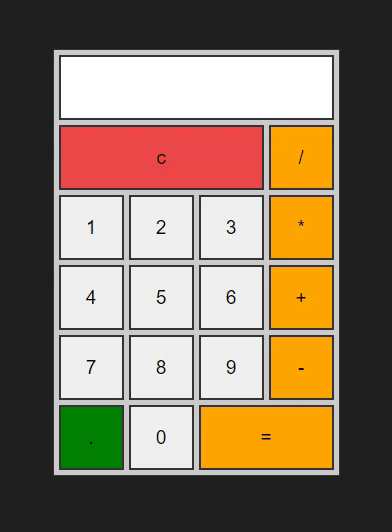

# calculator


## 기능 
사칙연산이 가능한 계산기

## 학습  
### 1. JS : eval()   
: 내장 함수 eval을 사용하면 문자열 형태의 코드를 실행

```
let code = 'alert("Hello")';
eval(code); // Hello
```
```
let value = eval('1+1');
alert(value); // 2
```

: eval(code)을 호출하면 문자열 형태의 code가 실행되는데 이때 마지막 구문의 결과가 반환됩니다.

: 모던 자바스크립트엔 eval을 대체할 수 있는 문법이 많기 때문에, 모던 자바스크립트를 사용하는 코드에선 eval을 잘 사용하지 않습니다.

: eval을 이용해 만든 코드는 외부 지역 변수에 접근할 수 있는데, 이는 좋지 않은 방법입니다.
전역 스코프에서 eval을 사용하지 말고, window.eval(code)을 이용하세요.

: 외부 스코프에 있는 데이터가 필요하다면 new Function의 인수에 코드를 전달해 사용하시면 됩니다.


## 학습출처 
**유튜브**    
https://www.youtube.com/@sucoding     

**JS**   
https://ko.javascript.info/eval       
  
**키워드**   
eval()     